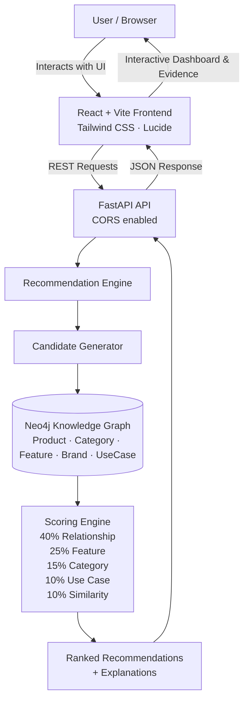

# ShopGraph
### Knowledge Graph Based Product Recommendation System

> **Portfolio Project** · Python · Neo4j · FastAPI · Cypher · Knowledge Graph

---

## 📌 Problem

Traditional recommendation systems rely on:
- **Collaborative filtering** — "users who bought X also bought Y"
- **Content-based filtering** — "products similar to X by attribute similarity"

Both approaches have a core weakness: **they cannot explain *why* a product is recommended** in human-readable terms. They are also heavily dependent on large amounts of historical user data.

---

## 💡 Solution — Knowledge Graph Recommendations

ShopGraph builds a **Knowledge Graph** in Neo4j where products are connected by meaningful, curated relationships:

```
Product ──BELONGS_TO──▶ Category
Product ──MADE_BY──────▶ Brand
Product ──HAS_FEATURE──▶ Feature
Product ──USED_FOR─────▶ UseCase
Product ──COMPATIBLE_WITH──▶ Product
Product ──ACCESSORY────▶ Product
Product ──WORKS_WITH───▶ Product
Product ──SIMILAR_TO───▶ Product
```

By **traversing the graph** from a purchased product, the system discovers meaningful candidates and produces **explainable recommendations** — e.g. *"Recommended because it is compatible with your laptop and shares USB-C connectivity."*

---

## 🏗 Architecture

```text
ShopGraph
│
├── React Frontend (Vite + Tailwind CSS + Axios + Lucide)
│        │
│        ↓
│     FastAPI (REST API with CORS enabled)
│        │
│        ↓
│ Recommendation Engine (5-dimensional scoring)
│        │
│        ↓
│      Neo4j (Graph Database)
│        │
│        ↓
│ Knowledge Graph (Products, Categories, Brands, Features, Use Cases)
```



---

## 🕸 Knowledge Graph Example

Here is how **Dell Inspiron 15** looks in the graph:

```
Dell Inspiron 15
    │
    ├── BELONGS_TO  ──▶ Laptop
    ├── MADE_BY     ──▶ Dell
    │
    ├── HAS_FEATURE ──▶ USB-C
    ├── HAS_FEATURE ──▶ Bluetooth
    ├── HAS_FEATURE ──▶ WiFi
    │
    ├── USED_FOR    ──▶ Programming
    ├── USED_FOR    ──▶ Office Work
    ├── USED_FOR    ──▶ Work From Home
    │
    ├── COMPATIBLE_WITH ──▶ Logitech MX Master 3S
    ├── COMPATIBLE_WITH ──▶ Dell USB-C Hub
    ├── COMPATIBLE_WITH ──▶ Samsung T7 SSD 1TB
    │
    ├── ACCESSORY   ──▶ Dell Laptop Stand
    ├── ACCESSORY   ──▶ Dell Laptop Bag
    │
    ├── WORKS_WITH  ──▶ Dell 24 inch Monitor
    ├── WORKS_WITH  ──▶ Logitech C920 Webcam
    │
    └── SIMILAR_TO  ──▶ HP Pavilion 15
```

---

## 🔄 Recommendation Flow

```
Purchased Product
       ↓
Find Product in Neo4j KG
       ↓
Generate Candidates via Graph Traversal
  ├── A. Direct Relationships (COMPATIBLE_WITH, ACCESSORY, WORKS_WITH, SIMILAR_TO)
  ├── B. Shared Features (e.g., both have USB-C)
  ├── C. Shared Use Cases (e.g., both for Programming)
  └── D. Same Category (alternatives)
       ↓
Score Each Candidate
  ├── 40% — Relationship Match
  ├── 25% — Feature Overlap
  ├── 15% — Category Match
  ├── 10% — Use Case Overlap
  └── 10% — Similarity Relationship
       ↓
Rank (sort by score descending)
       ↓
Generate Explanations (human-readable reasons)
       ↓
Return Top-K Recommendations
```

---

## 🗂 Project Structure

```
ShopGraph/
│
├── README.md              ← This file
├── requirements.txt       ← Python dependencies
├── .env.example           ← Environment variable template
├── .gitignore
│
├── data/                  ← CSV reference data
│   ├── products.csv
│   ├── categories.csv
│   ├── features.csv
│   ├── brands.csv
│   ├── use_cases.csv
│   └── relationships.csv
│
├── cypher/                ← Cypher scripts for Neo4j Browser
│   ├── 01_constraints.cypher
│   ├── 02_create_nodes.cypher
│   ├── 03_create_relationships.cypher
│   ├── 04_sample_queries.cypher
│   └── 05_visualization.cypher
│
├── app/                   ← Core Python application
│   ├── config.py          ← Settings from .env
│   ├── database.py        ← Neo4j connection
│   ├── models.py          ← Pydantic API models
│   ├── kg_loader.py       ← KG data + loader functions
│   ├── candidate_generator.py  ← Graph traversal for candidates
│   ├── recommender.py     ← Scoring + ranking engine
│   ├── explanation.py     ← Reason generation
│   └── main.py            ← FastAPI app
│
├── scripts/               ← Setup and demo scripts
│   ├── setup_database.py  ← Create constraints only
│   ├── load_kg.py         ← Full KG loader
│   └── test_recommendation.py  ← CLI demo
│
├── tests/                 ← Pytest test suite
│   ├── test_database.py
│   ├── test_recommender.py
│   └── test_api.py
│
└── sample_output/
    └── recommendation_example.json
```

---

## ⚙️ Setup

### 1. Clone the repository

```bash
git clone https://github.com/your-username/ShopGraph.git
cd ShopGraph
```

### 2. Create a virtual environment

```bash
python -m venv venv
```

**Windows:**
```bash
venv\Scripts\activate
```

**Linux / macOS:**
```bash
source venv/bin/activate
```

### 3. Install dependencies

```bash
pip install -r requirements.txt
```

### 4. Set up Neo4j

You need a running Neo4j instance. Choose one of:

**Option A — Neo4j Aura (free cloud):**
1. Go to [https://neo4j.com/cloud/platform/aura-graph-database/](https://neo4j.com/cloud/platform/aura-graph-database/)
2. Create a free AuraDB instance
3. Copy the connection URI, username, and password

**Option B — Neo4j Desktop (local):**
1. Download from [https://neo4j.com/download/](https://neo4j.com/download/)
2. Create a new database project
3. Start the database
4. Use `bolt://localhost:7687` as the URI

### 5. Configure credentials

Copy the example file and fill in your Neo4j credentials:

```bash
cp .env.example .env
```

Edit `.env`:
```
# For Neo4j Aura:
NEO4J_URI=neo4j+s://xxxxxxxx.databases.neo4j.io
NEO4J_USERNAME=neo4j
NEO4J_PASSWORD=your-aura-password

# For Neo4j Desktop (local):
# NEO4J_URI=bolt://localhost:7687
# NEO4J_USERNAME=neo4j
# NEO4J_PASSWORD=your-local-password
```

> ⚠️ Never commit your `.env` file. It is listed in `.gitignore`.

---

## 🚀 Load the Knowledge Graph

Run the loader script to populate Neo4j with all products, relationships, and constraints:

```bash
python scripts/load_kg.py
```

Expected output:
```
Connected to Neo4j at neo4j+s://...
🚀 Loading ShopGraph Knowledge Graph into Neo4j...
✅ Constraints created
✅ Categories inserted: 10
✅ Features inserted: 10
✅ Brands inserted: 12
✅ Use cases inserted: 8
✅ Products inserted: 20
✅ Relationships created: 171
🎉 Knowledge Graph loaded successfully!

📊 Knowledge Graph Statistics:
...
```

> ✅ The script uses `MERGE` — safe to run multiple times without creating duplicates.

---

## ▶️ Run the Full-Stack Application

### 1. Start the Backend

In your primary terminal:

```bash
cd ShopGraph
venv\Scripts\activate
python scripts/load_kg.py
uvicorn app.main:app --reload
```

The API will be available at: [http://127.0.0.1:8000](http://127.0.0.1:8000)  
Interactive docs (Swagger UI): [http://127.0.0.1:8000/docs](http://127.0.0.1:8000/docs)

### 2. Start the React Frontend

Open another terminal:

```bash
cd ShopGraph/frontend
npm install
npm run dev
```

Then open your browser at:
```text
http://localhost:5173
```

---

## 🧪 Run Tests

```bash
pytest
```

Or with verbose output:

```bash
pytest -v
```

> Tests require a running Neo4j instance with the KG loaded.

---

## 🌐 API Reference

### `GET /`

Welcome / health check.

```json
{
  "message": "ShopGraph Recommendation API",
  "version": "1.0.0"
}
```

---

### `GET /products`

List all products in the knowledge graph.

```bash
curl http://127.0.0.1:8000/products
```

---

### `GET /products/{product_name}`

Get full product details with all graph relationships.

```bash
curl "http://127.0.0.1:8000/products/Dell%20Inspiron%2015"
```

```json
{
  "name": "Dell Inspiron 15",
  "price": 55000,
  "category": "Laptop",
  "brand": "Dell",
  "features": ["USB-C", "Bluetooth", "WiFi"],
  "use_cases": ["Programming", "Office Work", "Work From Home"],
  "compatible_with": ["Logitech MX Master 3S", "Dell USB-C Hub", "..."],
  "accessories": ["Dell Laptop Stand", "Dell Laptop Bag"],
  "works_with": ["Dell 24 inch Monitor", "Logitech C920 Webcam"],
  "similar_to": ["HP Pavilion 15", "Lenovo IdeaPad Slim 5"]
}
```

---

### `GET /recommend/{product_name}?top_k=5`

Get product recommendations.

```bash
curl "http://127.0.0.1:8000/recommend/Dell%20Inspiron%2015?top_k=5"
```

```json
{
  "purchased_product": "Dell Inspiron 15",
  "recommendations": [
    {
      "product": "Dell USB-C Hub",
      "score": 91.5,
      "reasons": [
        "Directly compatible with the purchased product",
        "Shares USB-C feature with Dell Inspiron 15",
        "Useful for Office Work",
        "Useful for Work From Home"
      ]
    },
    {
      "product": "Logitech MX Master 3S",
      "score": 87.2,
      "reasons": [
        "Directly compatible with the purchased product",
        "Shares Bluetooth feature with Dell Inspiron 15",
        "Useful for Programming",
        "Useful for Office Work"
      ]
    }
  ]
}
```

If the product is not found:

```json
{
  "detail": "Product 'Unknown' not found in the knowledge graph."
}
```
HTTP status: `404 Not Found`

---

## 🖥 CLI Demo

Run a quick terminal demonstration (no browser needed):

```bash
python scripts/test_recommendation.py
```

Or test a specific product:

```bash
python scripts/test_recommendation.py "HP Pavilion 15" 5
```

---

## 📊 Scoring Formula

The recommendation score is fully transparent — no ML black box:

| Dimension          | Weight |
|--------------------|--------|
| Relationship Match | 40%    |
| Feature Overlap    | 25%    |
| Category Match     | 15%    |
| Use Case Overlap   | 10%    |
| Similarity         | 10%    |

```
Final Score (0–100) =
    0.40 × Relationship Score
  + 0.25 × Feature Score
  + 0.15 × Category Score
  + 0.10 × Use Case Score
  + 0.10 × Similarity Score
```

---

## 🗺 Neo4j Graph Exploration

After loading, you can explore the graph visually in **Neo4j Browser** (`http://localhost:7474`) or **Neo4j Aura Query Editor**.

Useful starter queries (from `cypher/04_sample_queries.cypher`):

```cypher
// See the full graph
MATCH (n)-[r]->(m)
RETURN n, r, m
LIMIT 100

// Find recommendations for Dell Inspiron 15
MATCH (p:Product {name: "Dell Inspiron 15"})
-[r:COMPATIBLE_WITH|ACCESSORY|WORKS_WITH|SIMILAR_TO]->
(c:Product)
RETURN c.name AS product, type(r) AS relationship

// Find products sharing features
MATCH (p:Product {name: "Dell Inspiron 15"})
-[:HAS_FEATURE]->(f:Feature)
<-[:HAS_FEATURE]-(c:Product)
WHERE c <> p
RETURN c.name AS product, collect(f.name) AS shared_features
```

---

## 🛠 Tech Stack

| Technology        | Purpose                              |
|-------------------|--------------------------------------|
| **React**         | Frontend declarative UI library      |
| **Vite**          | High-speed frontend build tool       |
| **Tailwind CSS**  | Utility-first modern SaaS styling    |
| **Lucide React**  | Clean, modern dashboard iconography |
| **Axios**         | Frontend HTTP REST client            |
| **Python 3.11+**  | Backend core application language    |
| **Neo4j**         | Graph database (Knowledge Graph)     |
| **Cypher**        | Graph query language                 |
| **neo4j driver**  | Python ↔ Neo4j communication         |
| **FastAPI**       | REST API framework (CORS enabled)    |
| **Pydantic**      | Data validation and serialisation    |
| **uvicorn**       | ASGI server for FastAPI              |
| **pandas**        | Data inspection (data/ CSV files)    |
| **python-dotenv** | Environment variable management      |
| **pytest**        | Testing framework                    |
| **httpx**         | HTTP client for API tests            |

---

## 👨‍💻 Author

Built as a portfolio project demonstrating:
- Knowledge Graph design and Neo4j
- Cypher query language
- Graph-based recommendation systems
- Explainable AI (XAI) principles
- Clean Python architecture
- FastAPI REST API development

---

## 📄 License

MIT License — free to use for personal and educational purposes.
